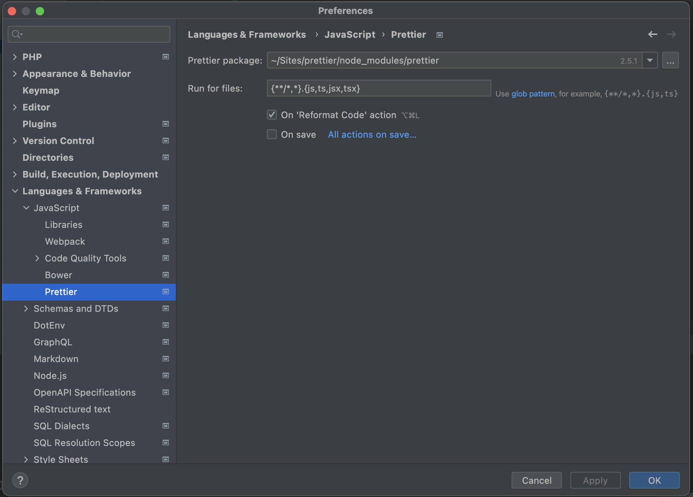

# Demo repository to reproduce a PHPStorm Prettier issue.

| Element         | Version                                                     |
|-----------------|-------------------------------------------------------------|
| PhpStorm        | 2021.3 _Build #PS-213.5744.279, built on December 2, 2021_  |
| Prettier Plugin | 213.5744.122                                                |
| Prettier config |                                        |

## What is the problem?

As defined in the [.prettierignore](.prettierignore) file, the expected result compared to the IDE result:

| File                  | Expected Result  | PhpStorm formatter Result | As Expected? |
|-----------------------|------------------|---------------------------|:------------:|
| src/no-pretty/app.js  | _ignored_        | **formatted**             |      ❌       |
| src/app.js            | **formatted**    | **formatted**             |      ✅       |
| src/webpack.config.js | _ignored_        | **formatted**             |      ❌       |

I think the `.prettierignore` is ignored by the IDE.

> N.B. When I run `yarn pretty:fix`, the only prettied file is **src/app.js** as expected.

Related issue: https://youtrack.jetbrains.com/issue/WI-64693
